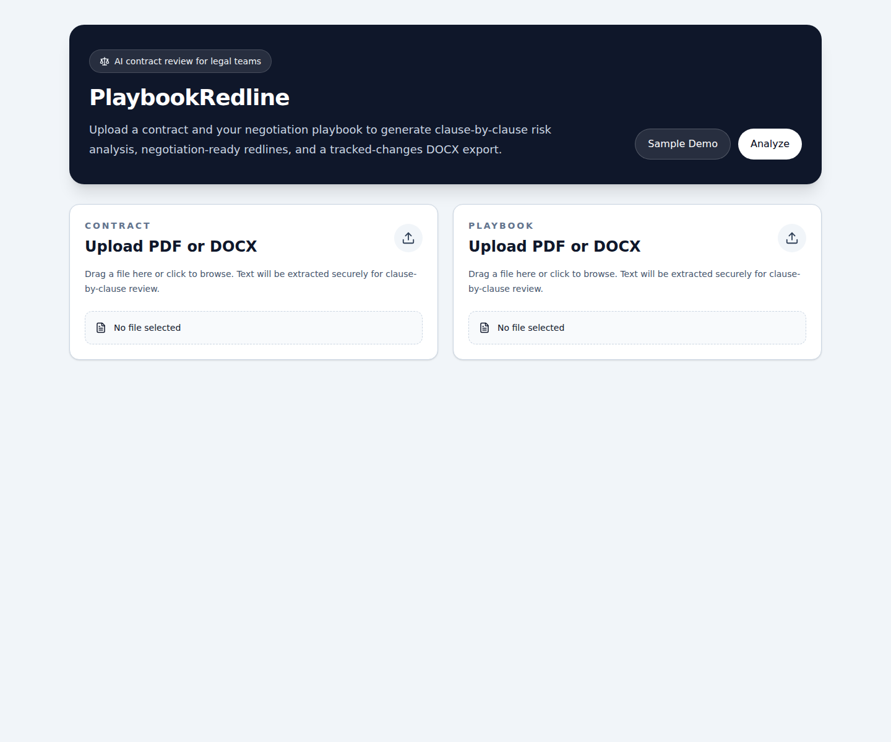
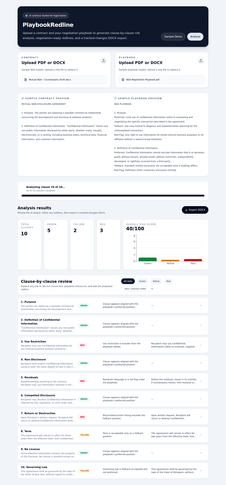
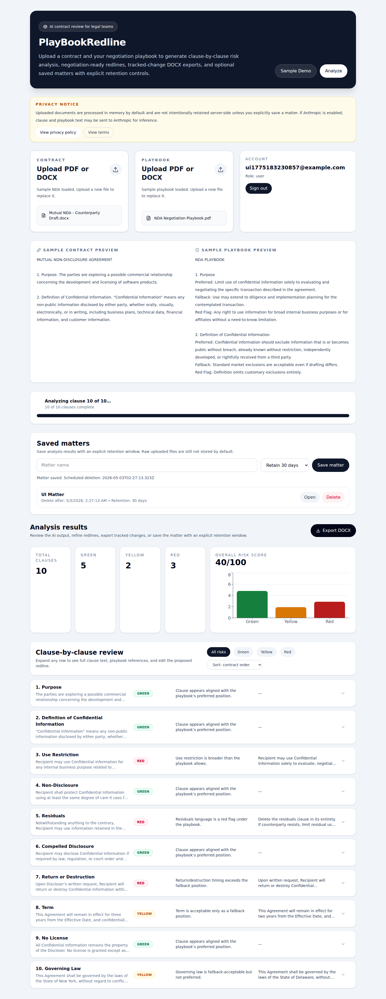
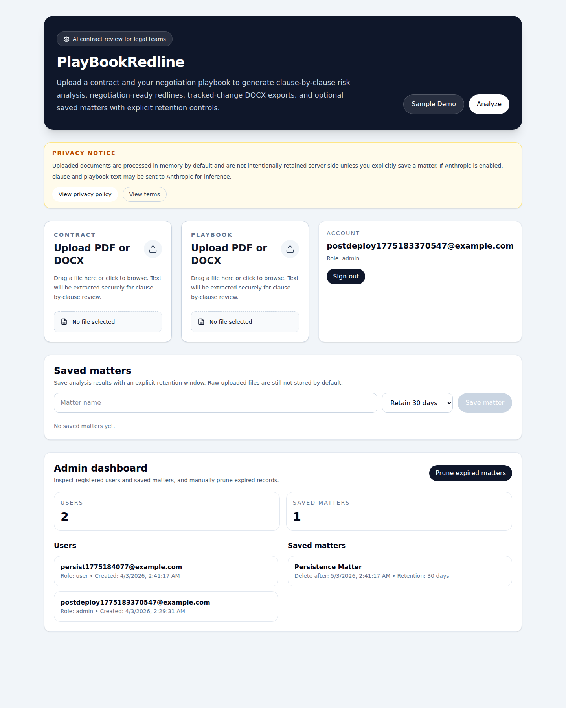

# PlayBookRedline

[](https://github.com/Rrosario88/PlayBookRedline/actions/workflows/ci.yml)
[](https://github.com/Rrosario88/PlayBookRedline/releases)
[](./LICENSE)
[](https://github.com/Rrosario88/PlayBookRedline/security/dependabot)

AI-powered contract review and redlining for lawyers.

PlayBookRedline lets a legal team upload a contract plus a negotiation playbook, then generates a clause-by-clause review with risk scoring, playbook references, suggested redlines, and a Word export with tracked changes.

Live VPS preview:
- https://playbookredline.187-124-249-117.sslip.io

## Screenshots

### Analysis workspace


### Sample demo results


### Authenticated saved matter workflow


### Admin dashboard


## Why this exists
Lawyers often review third-party paper against internal fallback positions, preferred terms, and red-flag clauses. That process is repetitive, time-sensitive, and difficult to standardize across a team.

PlayBookRedline turns a firm playbook into an interactive review workflow:
- upload a contract
- upload the firm playbook
- analyze every clause against preferred / fallback / red-flag guidance
- edit the AI redlines inline
- export a tracked-change DOCX for negotiation

## Core features
- PDF and DOCX upload for both contract and playbook
- Clause-by-clause analysis streamed live to the UI with SSE
- Risk scoring per clause: green / yellow / red
- Playbook reference for each flagged clause
- Inline editing of suggested redline language
- Sample NDA + playbook demo mode
- PostgreSQL-backed authentication with user/admin roles
- Saved matters with explicit 7/30/90-day retention controls
- Admin dashboard for inspecting users and retained matters
- Automated cron-based PostgreSQL backups and expired-matter cleanup
- DOCX export with real Word revision markup (`w:ins` / `w:del`)
- Dockerized deployment path for app + API

## Tech stack
Frontend
- React
- Vite
- TypeScript
- Tailwind CSS
- Recharts

Backend
- Node.js
- Express
- TypeScript
- Anthropic Claude (`claude-sonnet-4-20250514`)
- `mammoth` for DOCX parsing
- `pdf-parse` for PDF extraction
- `docx` for Word export
- `diff` for granular tracked redlines
- PostgreSQL for persistent application data

Infrastructure
- Docker Compose
- Caddy reverse proxy
- Automatic HTTPS via Let's Encrypt using `sslip.io`
- cron-based maintenance for backups and retention cleanup

## How it works
1. User uploads a contract and a playbook.
2. The backend extracts text from PDF/DOCX files.
3. The contract is split into clauses using heading and numbering heuristics.
4. Each clause is compared against the full playbook.
5. Results stream back progressively to the frontend.
6. The user edits proposed redlines if needed.
7. The system exports a DOCX with tracked changes.

## Risk model
- Green: clause matches preferred position
- Yellow: clause is acceptable only under fallback position
- Red: clause violates the playbook or contains red-flag language

## Project structure
```text
client/
  src/
    components/
    hooks/
    types/
server/
  routes/
  services/
  prompts/
  sample/
.github/
  workflows/
docs/assets/
Caddyfile
compose.yaml
```

## Local development
### 1) Backend
```bash
cd server
npm install
npm run dev
```

### 2) Frontend
```bash
cd client
npm install
npm run dev
```

Frontend runs on:
- http://localhost:5173

Backend runs on:
- http://localhost:3001

## Docker
Run the whole stack:
```bash
docker compose up --build
```

Open locally:
- HTTPS app: https://playbookredline.187-124-249-117.sslip.io
- Local API health inside compose is proxied through the site under `/api/health`

## Environment variables
Create a root `.env` or export variables before starting:

```bash
ANTHROPIC_API_KEY=your_key_here
PORT=3001
CORS_ORIGIN=https://playbookredline.187-124-249-117.sslip.io,http://localhost:5173,http://localhost:8080
```

Notes:
- If `ANTHROPIC_API_KEY` is not set, the app falls back to deterministic heuristic analysis for demo/local usage.
- The export engine still produces a valid redline workflow without Claude, but the legal analysis quality is best with the model enabled.

## Security and deployment notes
- Only ports 80 and 443 are exposed publicly
- Backend is no longer directly published to the internet
- Caddy terminates TLS and proxies traffic internally
- Helmet enabled on the API
- Compression enabled, with SSE-safe exclusions
- Basic API rate limiting enabled
- CI workflow builds both client and server, plus Docker compose build validation
- Branch protection configured on `main`
- Dependabot and automated security fixes enabled

## Current release
- Latest release: `v0.1.0`

## Roadmap ideas
- More precise clause segmentation for complex agreements
- Matter/workspace history and saved analyses
- Authentication and team collaboration
- Custom domain + managed DNS instead of `sslip.io`
- More granular legal diffing rules for defined terms and numbering

## Contributing
Issues and pull requests are welcome. Please include clear reproduction steps, expected behavior, and screenshots when relevant.

## License
MIT


## Privacy and retention
A privacy-first retention model is documented in:
- [Privacy and Data Retention Policy](PRIVACY.md)

Current default behavior:
- uploaded files are processed in memory
- original files are not intentionally persisted by default
- extracted text and analysis results are not intentionally stored server-side by default
- exported DOCX files are generated in memory and returned to the client
- if Anthropic is enabled, legal text may be sent to Anthropic for inference
